# Predicting long-term response to Drug X from early-treatment data

[](https://github.com/Wrlog/remission-prediction-shap/actions/workflows/tests.yml)

Everything here runs on simulated data. It's a research and teaching demo, it hasn't been validated, and it
must not be used for patient care.

The question: using what's known in the first weeks of treatment with a hypothetical IV drug (Drug X), can I
predict whether a patient's biomarker will be at target about a year later, and do individual PK/PD estimates
help beyond the raw clinical data? This follows the general approach of my PhD work on model-informed
precision dosing. The real data and results from that work aren't public, so the cohort, the numbers and the
design choices below are all made up for this repo.

Because the data come from a known PK/PD model, I can check the models against the true probability of
reaching target, and check SHAP against the true mechanism.

## Results

- With baseline data only (L1), all four algorithms reach an out-of-fold AUROC of about 0.80. The true
  simulated probabilities reach 0.98, so there's a lot left to explain.
- Adding the first PK/PD block (MAP estimates from data up to the second infusion) raises AUROC by 0.013 to
  0.033. A naive paired t-test calls every one of these significant (p = 0.012 to 0.043). The corrected
  resampled t-test doesn't (p = 0.21 to 0.33).
- More clinical data to the third infusion adds little (+0.009 to +0.020, corrected p > 0.36).
- Re-estimating PK/PD with data up to the first maintenance infusion (day 98) is the big step: +0.043 to
  +0.087, corrected p < 0.02 for three of the four algorithms. IC50 is barely identifiable from early data and
  much clearer by day 98, and the day-98 IC50 estimate is the top feature in every refitted model.
- That step mixes two things: later data and the model. A check that feeds the same day-98 data in as raw
  values instead (L4r) does just as well. Tree models do slightly better with the raw values (-0.013 to
  -0.024 for L4 against L4r) and the elastic net slightly worse (+0.009). None of these differences is
  significant. So in this simulation the PK/PD model mostly repackages information the raw data already
  carry.
- The best configuration is elastic-net logistic regression on L4: AUROC 0.925 (SD 0.006 over repeats),
  bootstrap 95% CI 0.893 to 0.960 on the averaged out-of-fold predictions. The linear model beats the
  three tree ensembles at L4 and L5 by 0.026 to 0.042.
- Missingness depends on the study, and the checks show it: a model on missing-value indicators alone
  reaches 0.64 to 0.68 and a model on study membership alone 0.68.
- SHAP from all four refitted models puts the day-98 IC50 estimate first (22 to 27% of the total). Summed
  SHAP per mechanism group tracks the true Shapley split of the late biomarker well for baseline level
  (Spearman 0.80 to 0.92) and drug sensitivity (0.69 to 0.79), and poorly for exposure (0.54 for the
  elastic net, 0.41 for random forest, nothing for XGBoost and CatBoost, whose feature elimination dropped
  every exposure feature).

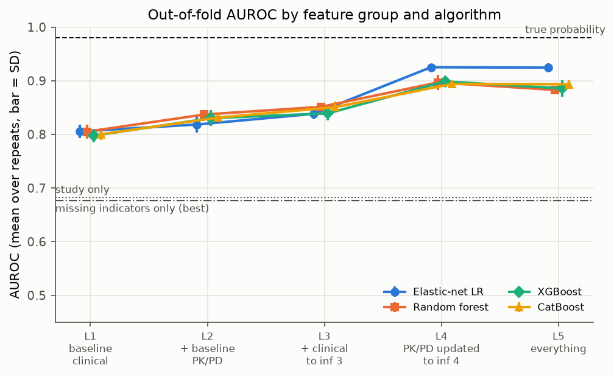

## The simulated studies

All four of my demo repos share one made-up PK/PD model for Drug X. PK is two-compartment with a 2 h
infusion and weight-based dosing (CL 0.30 L/day with weight, albumin, INF and ADA covariates, 30% IIV and
15% IOV per dosing interval; V1 3.2 L, Q 0.50 L/day, V2 2.0 L). PD is an indirect response in which drug
inhibits production of the biomarker, driven by the average concentration over each dosing interval (Cave),
with BASE 600 units and IC50 3.0 mg/L (60% and 90% IIV) and kout 0.04/day. Residual error is 15% on drug
levels and 25% on the biomarker. I haven't changed any of those numbers. Here Cave is the exact interval
average from the closed-form PK solution, which is what a fine grid converges to.

What this repo adds:

- Regimen: 5 mg/kg on days 0, 21 and 42, then every 56 days from day 98. Visits after the first move by up to
  2 days (induction) or 3 days (maintenance).
- ADA onset: from the second dose on, each dosing interval has a chance of antibodies appearing, with
  logit p = -2.6 - 1.5 log(Cave of the previous interval / 20) - 1.2 x co-medication. Onset is at a random
  time in the interval, and CL goes up 1.8-fold from then.
- Labs after baseline follow the biomarker: INF and PLT fall and albumin rises as the biomarker drops, with
  visit-to-visit noise. PK uses the baseline covariates.
- Three studies that enroll different patients and measure different things:

| Study | Patients | Median weight | Co-medication | Inflammation | What it measured | At target | ADA by outcome |
|---|---:|---:|---:|---|---|---:|---:|
| A | 78 | 64 kg | 60% | typical | all labs at every visit, peak levels after infusions 1 and 3, no ADA test until day 98 | 87% | 13% |
| B | 62 | 40 kg | 30% | higher | PLT at baseline only, no ADA test until day 98 | 68% | 45% |
| C | 50 | 58 kg | 5% | highest | albumin and PLT at baseline only, no biomarker or drug level at infusion 2, ADA tested from infusion 2 | 54% | 28% |

Scheduled samples after screening go missing 8% of the time. Screening labs and the baseline biomarker are
always there.

The outcome is the first recorded biomarker value between day 315 and day 399, and a patient is at target
if it's below 200 units. It's read off the noisy simulated record, so no separate risk model is involved.
One patient had no value in the window and is left out, which leaves 189 patients, 72% at target. For each
patient I also keep the noise-free biomarker at that visit and the true probability of an observed value
below 200. That probability gives the ceiling of 0.98 in the figure above.

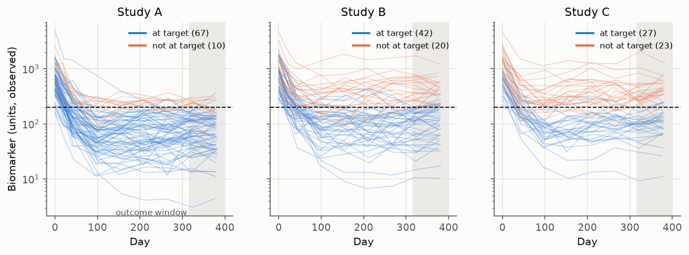

## Features

Features are indexed by infusion (first, second, third). Clinical features at infusion k are the pre-dose
values at that visit: albumin, INF, PLT, the biomarker, its log change from baseline, the drug level and the
ADA test. The baseline block adds age, sex, weight, an activity score and co-medication. Neither age nor sex
affects anything in the simulation, and the activity score only correlates with inflammation.

Each PK/PD block k holds MAP estimates of CL, V1, BASE and IC50, plus the predicted Cave over interval k,
fitted to everything recorded up to the next infusion. So block 1 uses data to day 21, block 2 to day 42 and
block 3 to day 98. The fit is sequential: CL and V1 from the drug levels first, then BASE and IC50 from the
biomarker with Cave from those PK estimates. The prior is the shared population model, treated as a
published model, so nothing is fitted on this cohort and the blocks can be computed once without any
train/test issue. The fitting model has no IOV and doesn't know when antibodies appeared: after a positive
test it puts onset halfway back to the previous visit. Skewed quantities go in on the log scale.

How well the MAP estimates recover the true values (correlation on the log scale, and shrinkage as
1 - SD(eta hat)/omega):

| Data up to | CL | V1 | BASE | IC50 |
|---|---|---|---|---|
| infusion 2 (day 21) | 0.86, 0.20 | 0.90, 0.53 | 0.94, 0.08 | 0.31, 0.81 |
| infusion 3 (day 42) | 0.94, -0.03 | 0.90, 0.51 | 0.96, 0.07 | 0.41, 0.48 |
| infusion 4 (day 98) | 0.95, -0.03 | 0.90, 0.22 | 0.96, 0.06 | 0.79, 0.12 |

V1 is well correlated from the start only because weight explains most of it. The small negative
shrinkage for CL means the estimates spread a bit more than the prior, because the fitting model ignores IOV
and the exact ADA onset. IC50 is the one that changes: with a 17-day biomarker half-life, three weeks of data
say little about it.

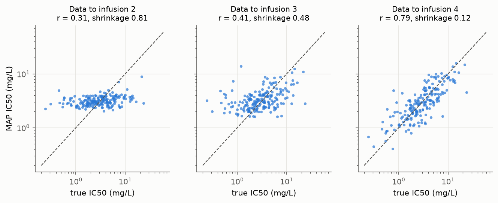

### Leakage guard

Every block declares a cutoff visit, and its builder only ever receives records up to that visit's infusion
time (pre-dose samples at that visit count, anything after the infusion doesn't). The MAP fit refuses records
past its cutoff. `check_ladder` rejects any block that reaches past the first maintenance infusion or has no
declared cutoff, and checks that day 98 is well before the outcome window. The tests in
[`tests/test_leakage.py`](tests/test_leakage.py) scramble every record after each block's cutoff and assert
that the block doesn't move, scramble everything after day 98 and assert that no feature moves, and confirm
that the later blocks do react to earlier data, so the scramble test isn't passing trivially.

## Feature ladder

| Step | Contents | Features | Known by |
|---|---|---:|---|
| L1 | baseline clinical | 9 | day 0 |
| L2 | L1 + PK/PD block 1 | 14 | day 21 |
| L3 | L2 + clinical at infusions 2 and 3 | 28 | day 42 |
| L4 | L3 with PK/PD block 3 in place of block 1 | 28 | day 98 |
| L5 | everything: clinical to infusion 3 and all three PK/PD blocks | 38 | day 98 |
| L4r (check) | L3 + raw clinical values at day 98 | 35 | day 98 |

The planned contrasts are L1 to L2 (value of early PK/PD), L2 to L3 (later clinical data), L3 to L4
(re-estimating PK/PD later) and L4 to L5 (keeping the earlier blocks as well). L4r against L4 asks whether the
model adds anything over the same data used raw.

## Models and validation

- Algorithms: elastic-net logistic regression, random forest, XGBoost and CatBoost. No voting or stacking.
- Repeated nested CV: 3 repeats of stratified 5-fold outer CV. Inside each outer training fold, a stratified
  4-fold inner CV runs a randomized search over 6 configurations, scored on AUROC. The outer folds depend
  only on the repeat, so every algorithm and ladder step sees the same splits.
- Tree models go through recursive feature elimination (RFE) inside the inner loop, ranked by the same model
  type, dropping a third of the starting features per step. The number kept (6, 12 or 18, capped at the
  number available) is tuned with the other hyperparameters. The elastic net selects through its L1 part.
- Missing data, fitted inside each training fold: drop any column more than 70% missing, then fill with the
  per-visit median. The early ADA tests (only in study C, about 76% missing) are dropped in every fold.
- Reported AUROC is the grand mean of the per-repeat mean over folds, with the SD across repeats. That SD only
  reflects seed sensitivity.
- Ladder contrasts use the Nadeau and Bengio corrected resampled t-test on the 15 paired per-fold
  differences.
- Leave-one-study-out: train on two studies (with the same inner search) and test on the third.
- Checks: a model on missing-value indicators only, and a model on study membership only (elastic net and
  XGBoost, same nested CV).
- Imputation sensitivity on L5 for all four algorithms: per-visit median, mean, KNN (k = 7), iterative
  chained imputation, and carry-forward from the previous visit then median. This uses the first repeat only.
- Calibration slope and intercept from logistic recalibration of the out-of-fold predictions (averaged over
  repeats), a calibration curve, a precision-recall curve against prevalence, and a decision curve.
- SHAP: the search is run once more on the full cohort (L5) for each algorithm, and the best configuration
  is refitted and explained with TreeExplainer or LinearExplainer.

## Results in detail

AUROC, mean (SD over 3 repeats):

| Step | Elastic net | Random forest | XGBoost | CatBoost |
|---|---|---|---|---|
| L1 | 0.806 (0.013) | 0.805 (0.013) | 0.798 (0.013) | 0.800 (0.011) |
| L2 | 0.818 (0.015) | 0.837 (0.009) | 0.830 (0.015) | 0.831 (0.002) |
| L3 | 0.838 (0.010) | 0.851 (0.005) | 0.839 (0.013) | 0.851 (0.010) |
| L4 | 0.925 (0.006) | 0.897 (0.014) | 0.899 (0.010) | 0.894 (0.007) |
| L5 | 0.925 (0.009) | 0.883 (0.001) | 0.886 (0.015) | 0.894 (0.007) |
| L4r | 0.916 (0.013) | 0.915 (0.002) | 0.912 (0.004) | 0.918 (0.009) |

The SD across outer folds is much larger, 0.05 to 0.09, since each test fold has only 38 patients.

Change in AUROC per step, with the corrected p-value:

| Contrast | Elastic net | Random forest | XGBoost | CatBoost |
|---|---|---|---|---|
| L1 to L2 | +0.013 (0.29) | +0.032 (0.21) | +0.033 (0.33) | +0.031 (0.26) |
| L2 to L3 | +0.020 (0.37) | +0.014 (0.67) | +0.009 (0.76) | +0.019 (0.40) |
| L3 to L4 | +0.087 (<0.001) | +0.045 (0.010) | +0.059 (0.018) | +0.043 (0.080) |
| L4 to L5 | -0.001 (0.80) | -0.014 (0.35) | -0.013 (0.30) | -0.001 (0.96) |
| L4r to L4 | +0.009 (0.58) | -0.018 (0.46) | -0.013 (0.46) | -0.024 (0.33) |

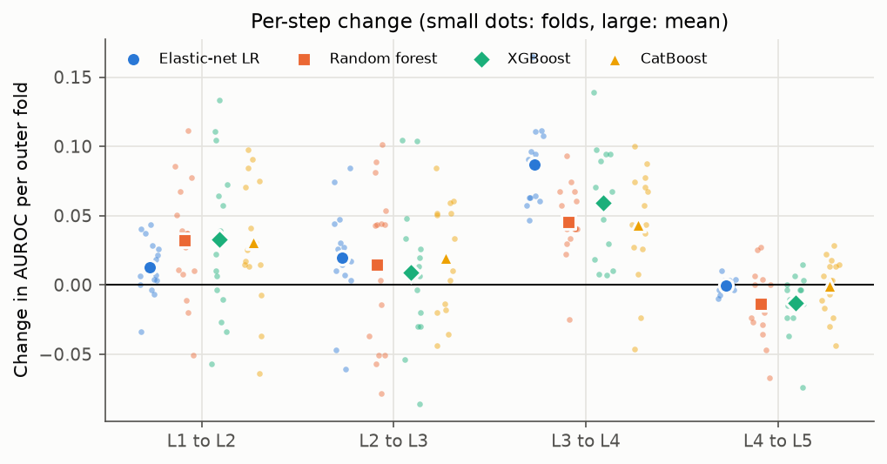

Leave-one-study-out AUROC:

| Held-out study (at target) | Step | Elastic net | Random forest | XGBoost | CatBoost |
|---|---|---|---|---|---|
| A (87%) | L1 | 0.770 | 0.790 | 0.765 | 0.742 |
| A | L4 | 0.887 | 0.887 | 0.885 | 0.922 |
| A | L5 | 0.888 | 0.903 | 0.891 | 0.896 |
| B (68%) | L1 | 0.670 | 0.742 | 0.727 | 0.658 |
| B | L4 | 0.871 | 0.807 | 0.855 | 0.837 |
| B | L5 | 0.867 | 0.821 | 0.824 | 0.846 |
| C (54%) | L1 | 0.850 | 0.857 | 0.834 | 0.863 |
| C | L4 | 0.939 | 0.895 | 0.894 | 0.911 |
| C | L5 | 0.942 | 0.915 | 0.908 | 0.923 |

Discrimination holds up in a study the model hasn't seen, even though the panels differ and columns that
only one study measured are dropped when that study is held out. Study B, with the lightest patients and the
most ADA, is the hardest. All steps are in [`results/loso.csv`](results/loso.csv).

Imputation sensitivity on L5 (first repeat, mean over 5 folds):

| Imputation | Elastic net | Random forest | XGBoost | CatBoost |
|---|---|---|---|---|
| Per-visit median | 0.934 | 0.883 | 0.893 | 0.901 |
| Mean | 0.934 | 0.887 | 0.886 | 0.890 |
| KNN (k = 7) | 0.935 | 0.881 | 0.905 | 0.863 |
| Iterative | 0.934 | 0.875 | 0.903 | 0.898 |
| Carry forward + median | 0.942 | 0.872 | 0.905 | 0.898 |

The spread within an algorithm is at most 0.04, well inside the fold-to-fold SD, so the choice of imputer
doesn't change the conclusions.

Calibration and decisions for the best configuration (L4 elastic net): calibration slope 1.08 and intercept
0.03, so its probabilities are about right. XGBoost is overconfident (slope 0.78 to 0.88 across steps) and
random forest underestimates the chance of being at target (intercept 0.20 to 0.46 at L1, L3, L4 and L5). All
values are in [`results/calibration_stats.csv`](results/calibration_stats.csv). AUPRC is 0.97 at L4 against
0.89 at L1, with a prevalence of 0.72.

For the decision curve the action is dose intensification for a patient predicted to miss target, so the
event is "not at target". The L4 model has a higher net benefit than intensifying everyone or no one at every
threshold from 0.05 to 0.60 (for example 0.21 at a threshold of 0.3, where treating everyone gives -0.03).
The baseline model is no better than intensifying everyone below a threshold of about 0.1.

<p>
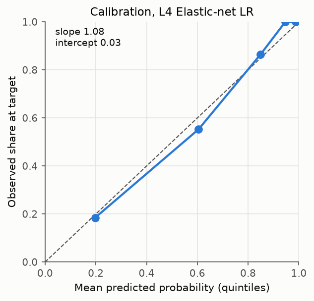
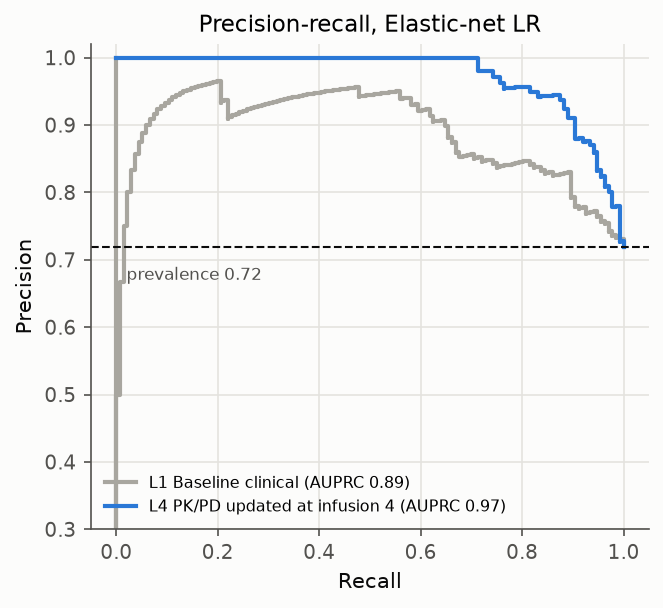
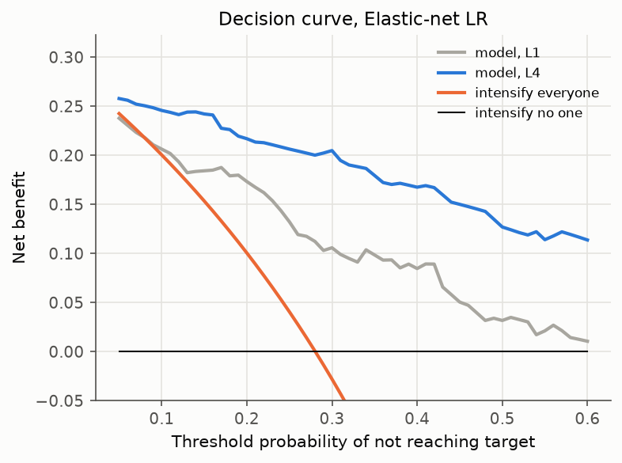
</p>

Selection frequency over the 15 outer folds on L5: the day-98 IC50 estimate is kept in every fold by all four
algorithms, and the BASE estimates and baseline INF in most. The per-feature shares are in
[`results/selection_frequency.csv`](results/selection_frequency.csv) and
[`figures/selection_frequency.png`](figures/selection_frequency.png).

## SHAP

The refitted models keep 29 features (elastic net), 12 (random forest) and 6 (XGBoost and CatBoost). SHAP is
on the log-odds scale except for random forest, where it's on the probability scale, so sizes aren't comparable
across panels.

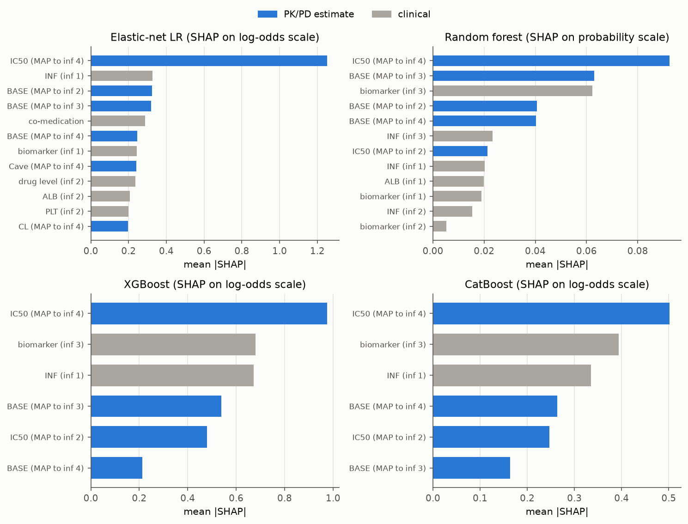

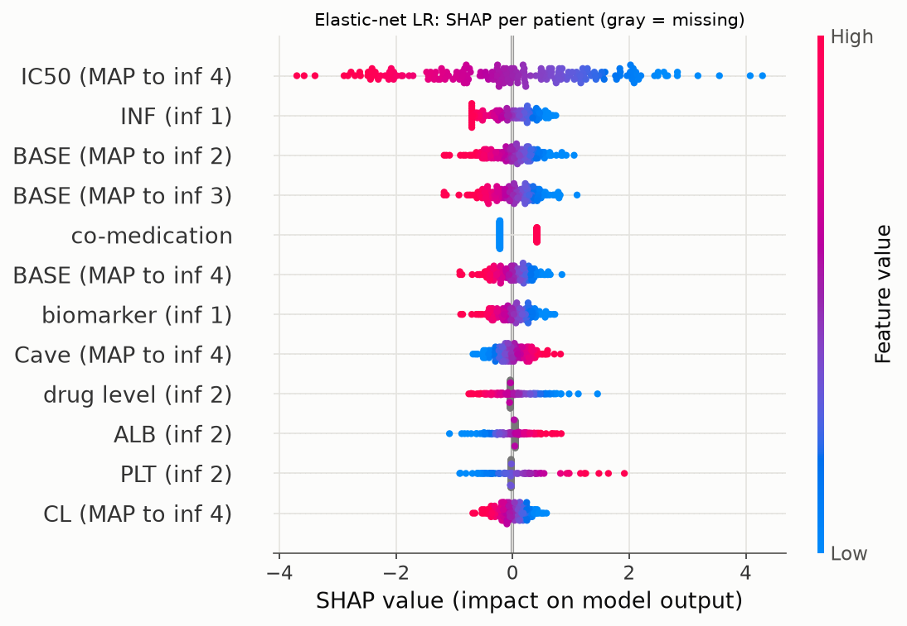

A high IC50 estimate pushes the prediction away from target, as does a high BASE or baseline INF. Dot plots for
the other three are in `figures/shap_dot_*.png`. The consensus view shows the share of total |SHAP| per
feature across algorithms. IC50 to day 98 is at the top for all four, and the trees lean more on the raw
day-42 biomarker.

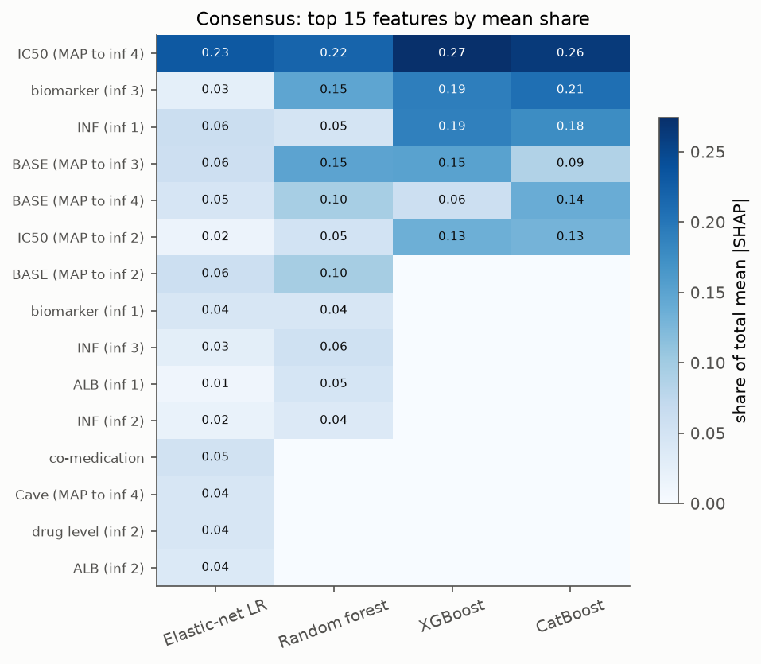

To compare SHAP with the mechanism, I split the true late biomarker (as -log B at the outcome visit) into
exact Shapley parts for BASE, IC50 and the whole exposure path, against a reference patient at the cohort
medians. I then summed SHAP within feature groups that mostly carry each part. Biomarker and lab values after
baseline mix all three, so they get their own "early response" group.

| Algorithm | Exposure | Baseline level | Drug sensitivity | Share to age and sex |
|---|---|---|---|---|
| Elastic net | 0.54 | 0.92 | 0.79 | 0% |
| Random forest | 0.41 | 0.91 | 0.74 | 0% |
| XGBoost | none kept | 0.80 | 0.69 | 0% |
| CatBoost | none kept | 0.81 | 0.69 | 0% |

(Spearman correlation between summed SHAP and the true part, per patient.) The true split gives exposure 25%
of the variation. The models give it 0 to 18%, while baseline level and drug sensitivity get about their true
share. Part of the true exposure part comes from antibodies that appear during maintenance, after day 98,
which no early feature can see, and with 189 patients the trees' feature elimination drops the weaker
exposure features altogether.

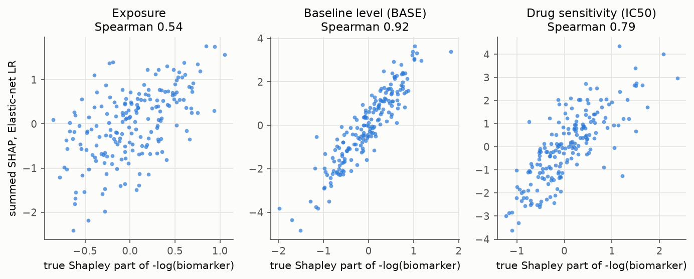

## Running it

Python 3.12:

```bash
python -m venv .venv
source .venv/bin/activate          # Windows: .venv\Scripts\activate
pip install -r requirements.txt
pip install --no-deps -e .
python -m pytest                   # about a minute
python scripts/run_pipeline.py     # full run, writes results/ and data/
python scripts/make_figures.py     # figures/ from results/
```

The full pipeline took 11 minutes on a 12-core laptop (`--jobs` sets the number of worker processes; the
default is the core count minus two). `--quick` runs a smaller cohort with one repeat and a tiny search; CI
runs it with the tests on every push. Settings are in [`src/remission/config.py`](src/remission/config.py).
Results were produced with the versions in `requirements.txt`, and other versions may shift the third
decimal.

## Layout

```
src/remission/
  config.py      shared PK/PD numbers, studies, panels, analysis settings
  pkpd.py        closed-form 2-compartment PK and the indirect response model
  simulate.py    cohort, sampling panels, outcome, true Shapley parts
  estimate.py    sequential PK-then-PD MAP fit for one patient and cutoff
  features.py    visit blocks, cutoffs, leakage guard, ladder
  models.py      pipelines, imputers, RFE, search spaces
  validation.py  nested CV, leave-one-study-out, corrected t-test, calibration, decision curve
  explain.py     SHAP, consensus, grouped SHAP against the truth
scripts/         run_pipeline.py, make_figures.py
tests/           PK/PD against an ODE solver, simulation structure, leakage, validation helpers
results/         every table the README quotes
figures/         every figure, drawn from results/
```

## Notes

- The MAP prior is the same population model that generated the data, apart from IOV and ADA timing. With
  real data the population model would have to come from outside the cohort, or be refitted inside each
  training fold, or later data would leak in through the population parameters.
- 3 repeats and 6 search configurations per inner loop keep the run on a laptop. The repeat SD is small
  because every repeat uses the same 189 patients; the fold SD and the bootstrap interval are the better guide
  to uncertainty.
- The L3 to L4 gain is about time as much as about the model, which is why I added L4r.
- The cohort size, study panels, ADA rule, windows and search settings are my choices for this demo.

## License

MIT, see [LICENSE](LICENSE).
